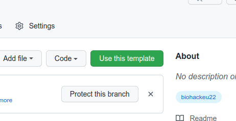

# BioHackrXiv Publication Template

Minimal example of a [BioHackrXiv](https://biohackrxiv.org/) publication that can be generated with the
[Preview Service](http://preview.biohackrxiv.org/).

## Step 1: Clone this Template Repository

This repository is a template repository. This means that you can hit the green "Use this template"
button (after logging in) to use it as a template to start a new BioHackrXiv Publication:



## Step 2: Configuring the Markdown

The publication Markdown is found in the `paper/paper.md` file. At the top you can edit the
YAML code with metadata. It is important to get this part correct, because otherwise the PDF
generation will fail. The metadata looks like this:

```yaml
title: 'BioHackSWAT4HCLS Report for Project <name>: <titl>'
title_short: 'BioHackSWAT4HCLS #26: <short title>'
tags:
  - <keyword1>
  - <keyword2>
  - <keyword3>
authors:
  - name: <Author Name>
    orcid: <Orcid>
    affiliation: 1
affiliations:
  - name: <affiliation>
    ror: <ror>
    index: 1
date: 26 March 2026
cito-bibliography: paper.bib
event: BHSWAT4HCLS26
biohackathon_name: "BioHackathon SWAT4HCLS 2026"
biohackathon_url:   "https://www.swat4ls.org/workshops/amsterdam2026/swat4hcls-biohackathon-2026/"
biohackathon_location: "Amsterdam, the Netherlands, 2026"
group: <group name>
# URL to project git repo --- should contain the actual paper.md:
git_url: https://github.com/SWAT4HCLS/publication-template-26
# This is the short authors description that is used at the
# bottom of the generated paper (typically the first two authors):
authors_short: <Name> \emph{et al.}
```

### Which metadata to update?

#### To change

The following fields should be changed:

* title
* title_short
* tags
* authors (name and optionally their ORCID identifier)
* affiliations
* date
* group
* authors_short

Particularly important to update is the following field, which should point to
your clone of the template, instead of the template itself:

* git_url: https://github.com/biohackrxiv/publication-template

## Step 3: Writing the article

A full Markdown example is given in [paper/paper.md](paper/paper.md). This includes instructions how to include
figures, tables, and annotate citations with the Citation Typing Ontology.

## Step 4: Previewing the paper as PDF

This repository can be converted into a preview PDF with BioHackrXiv [Preview Server](http://preview.biohackrxiv.org/).
The preview website asks for the link to your repository and will automatically find the `paper.md` and create an PDF.

## Troubleshooting

### The first page is badly formatted

Sometimes the list of authors plus affiliations runs over the page. We are working on a fix, but in the mean time you can try to shorten the affiliations. If that does not work move the affiliations into a repo and put the affiliations on a web page and use something like

```yaml
affiliations:
  - name: For remaining affiliations see \url{https://github.com/project/etc} \vspace{0.2in}
    index: \*
```
